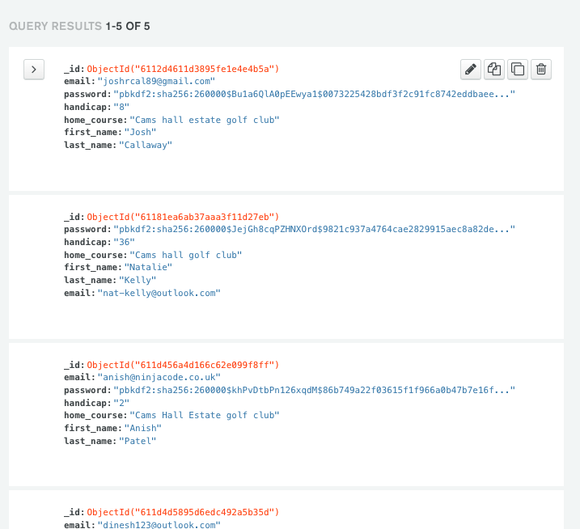

# FORE-PLAY Overview

Notes:
1. Set debug to false before deployment

Fore-play is a for golfers web application for updating and tracking your activity and play. Built in Python with Flask and using Materialize for quick construction. Feel free to fork the repository if you would like to further develop the site. Instructions for this are at the bottom of the page.

View live site here: http://fore-play-app.herokuapp.com/home

# Table Of Contents

- [User Experiance](#UX)
- [Design](#Design)
- [Technology / Features](#Technology)
- [Testing](#Testing)
- [Deployment](#Deployment)
- [Credit](#Credit)

# User Stories

#### 1. First time user - as a first time user i would like to

- understand what the site does from the home page
- easily navigate the site
- Sign Up
- See some visuals to intise me in

#### 2. Returning user - as a returning user i would like to

- Easily navigate the site
- Sign In
- Update my tracker
- See entries
- Update my profile

#### 3. Frequent user - as a frequent user i would like to

- see other peoples entries
- See social media links
- Contact the business
- Update my profile

# Design

### Colour Scheme

The colour scheme was chosen to match the asthetics of the site, being a golf web application. The colours are built in Materialize CSS colour choices with a simple green main colour theme.

### Typography

All fonts were taken from Google fonts (https://fonts.google.com/).

- Body/Main Font - Roboto

I chose this font for its readability at all sizes and its good solid structure to match the sites asthetics.

- Backup - Helvetica and Sans Serif

I chose to add backup fonts should there be any problem rendering the imported font and should the user not have functionality for the google font.

### Sizing

I chose REM as the primary unit metric due to its flexability with responsive design. I have also used PX where necessary for absolute sizing.

### Imagery

All images were free to licence and use from pixabay

# Design

### UI / Mockups

1) mobile

2) mobile

3) mobile

Design rationale - strategy, scope, structure, skeleton, surface
The application was designed to help users track their golf activity.

I used a simple flexable design that made sure all major functionality and calls to action were immediatly present, making the site easier to use and understand.

All site features are only a few clicks to prevent unneccesary complexity.

The main feature is a round tracker.

The colour scheme was chosen to match the asthetics of a golf application.

# Technology used

### Languages

- HTML5
- CSS3
- JavaScript (jQuery)
- Python
- MongoDB

### Frameworks / Features

- Materialize
- Google Fonts
- Flask
- Jinja
- Balsamiq
- Responsive Design
- Mobile First
- Font Awesome

### Imports

- Flask
- render_template
- url_for
- flash
- redirect
- request
- session
- PyMongo
- ObjectId
- Werkzeug (generate_password_hash, check_password_hash)

### Database / Schema

MongoDB was used for database support. Designed with a simple 2 table construction

# Testing

See TESTING.md for comprehensive testing

# Deployment

The site is deployed with Heroku. I chose Heroku for its ease of use and ability to support backend features. Code is tested and matches that of the dev environemtn and is free of commented out code.

Deployment instructions...

Heroku requires these files to run:

requirements.txt
Procfile

1. In Heroku, create an app with a unique name
2. Choose region and click 'Create App'
3. Select GitHub as Deployment method
4. Type in repo name and click search then connect

How to find variables to define in env.py...

1. Click on Settings tab
2. Click on Reveal Config Vars

Deploying app

1. Click on Deploy tab
2. enable automatic deploys
3. Click deploy branch. Make sure the master branch is selected
4. you should see - Your app was successfully deployed

### Forking

By forking the GitHub Repo, you make a copy of the original repository on your GitHub account to view and/or make changes without affecting the original repo. To do this, please follow the below steps...

1. Log in to GitHub and navigate to the GitHub Repo
2. At the top of the Repo (not top of the page) just above the "Settings" Button on the menu, locate the fork Button
3. Click the fork button
4. You should now have a copy of the original repo in your GitHub

### Cloning

1. Log in to GitHub and locate the GitHub Repo
2. Under the repo name, click 'code' to veiw the repo URL or download the ZIPPED file.
3. To clone the repo using HTTPS, under "Clone with HTTPS", copy the link.
4. Open terminal
5. Change the current working directory to the location where you want the cloned directory to be made.
6. Type git clone, and then paste the URL you copied in Step 3. $ git clone https://github.com/*repo-name*
7. Press Enter. Your local clone will be created.

# Credit

This is an original concept. The code is inspired by the python task manager app. Only images are taken from other sources.

## further Notes

With more time i would have liked to set up a admin account but due to the nature of the site, and the ability to access mongoDB for changing / deleting accounts, this was not set up for this itteration.
