# Overview

Below is the testing performed on this project. Testing was compiled throughout the project in effort to minimise bugs and styling issues.

# Table of contents

* [User stories](#User-stories)
* [Dev Tools Testing](#Dev-Tools-Testing)
* [Validators](#Validators)
* [Issues Faced](#Issues-Faced)

# User stories

In effort to improve UX/UI i regularly tested the site functionality and responsiveness. This way I could see UX/UI bugs first hand and deploy changes in accordance with the user stories and UI/UX principles. I also drafted in friends and family to attempt to break the site's viewing experience and functionality.

### UX Testing

1. First time user - as a first time user i would like to

- understand what the site does from the home page

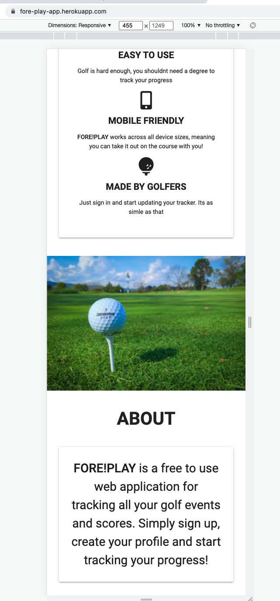

- easily navigate the site

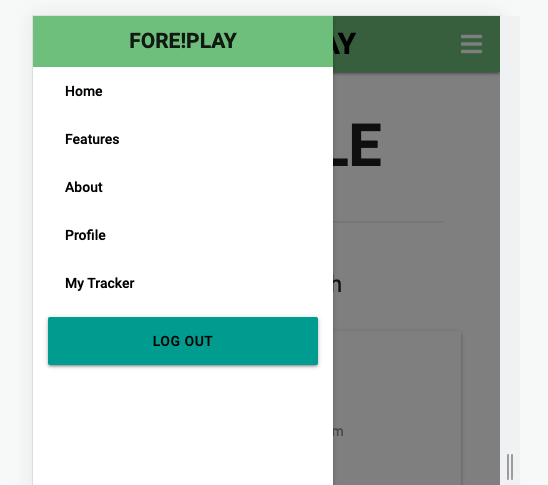

- Sign Up

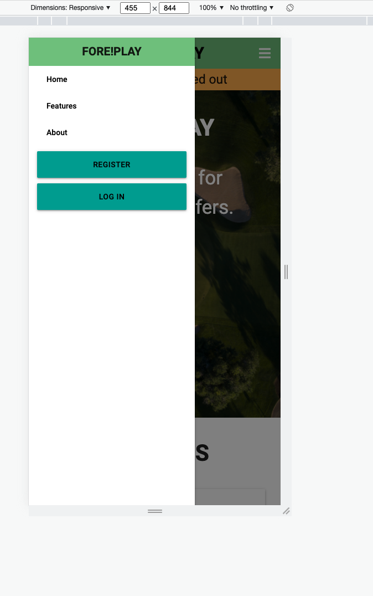

- See some visuals to intise me in

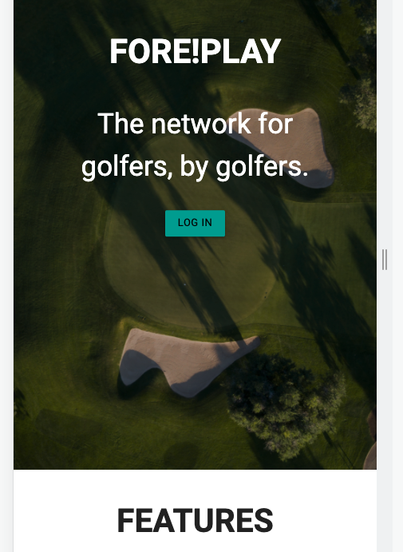

2. Returning user - as a returning user i would like to

- Sign In

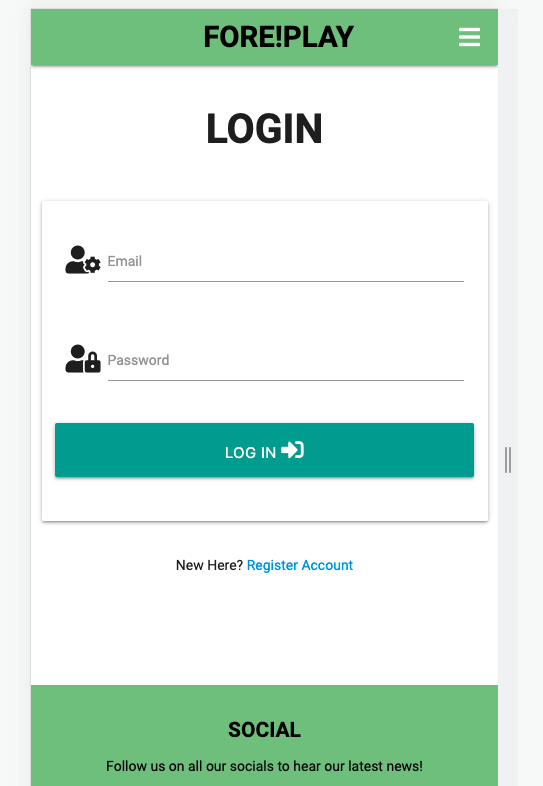

- Update my tracker

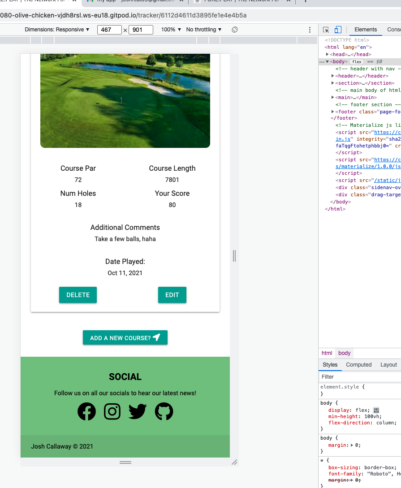

- See entries

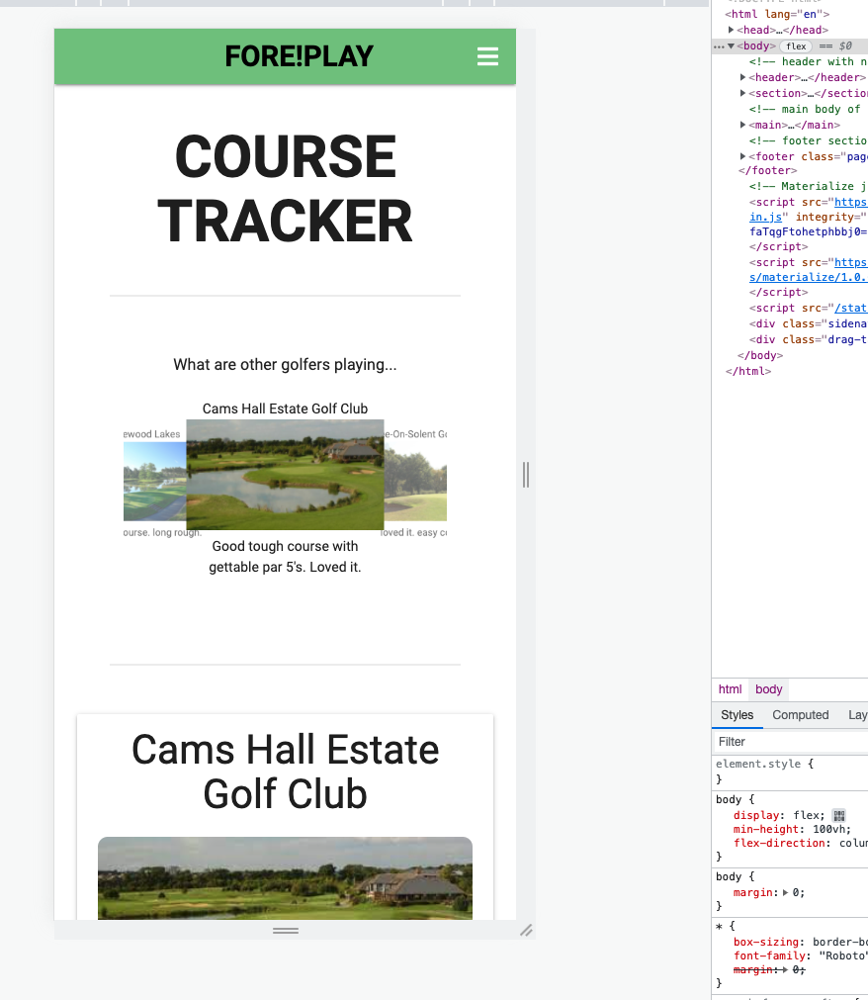

- Update my profile

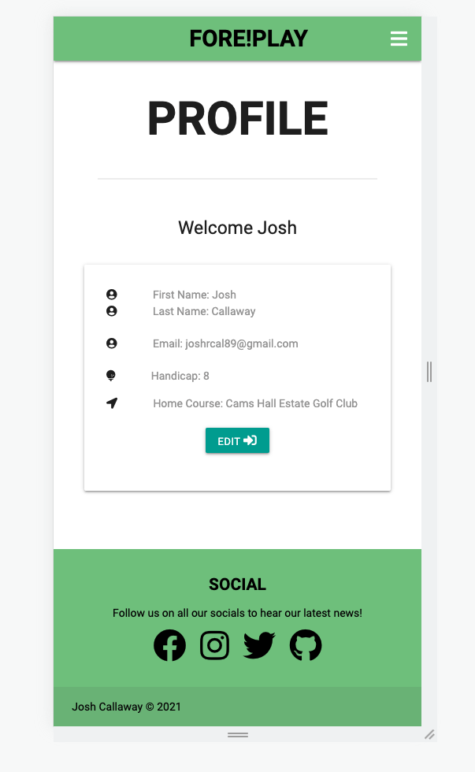

3. Frequent user - as a frequent user i would like to

- see other peoples entries

- See social media links

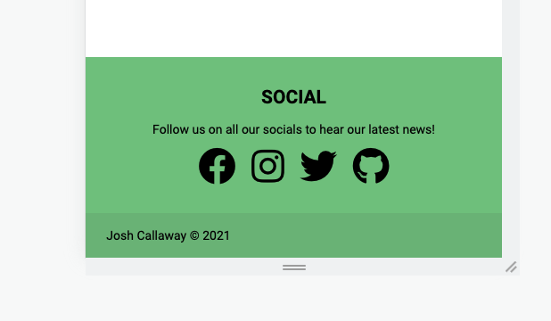

- Contact the business

Errors

The site has a 404 error page...

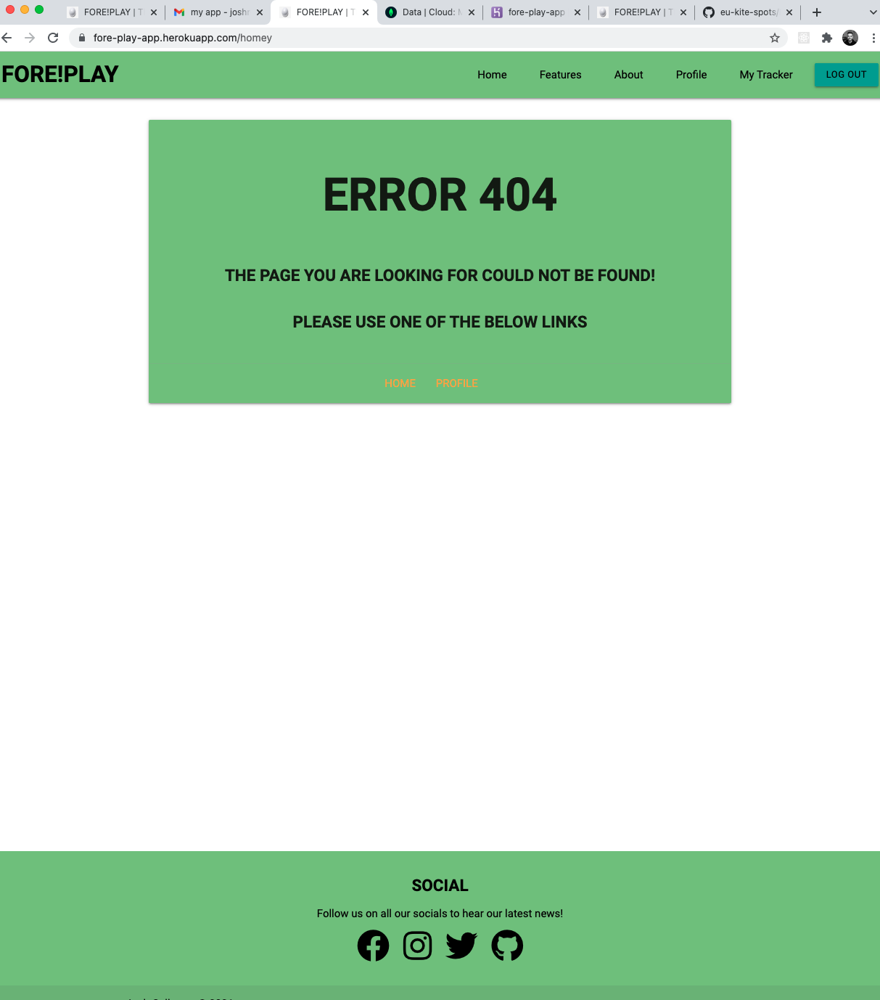

### Functional / Integration / manual Testing

1) Clicking the nav takes you to the relevant page - pass
2) form submission works - pass
3) Tracker shows your entries - pass
4) Clicking social links work - pass
5) Form validation works - pass
6) Clicking edit on tracker works - pass
7) Deleting tracker entries works - pass

Testing images

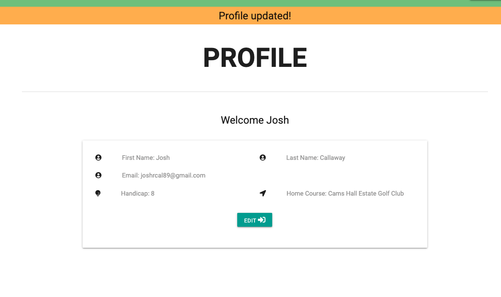
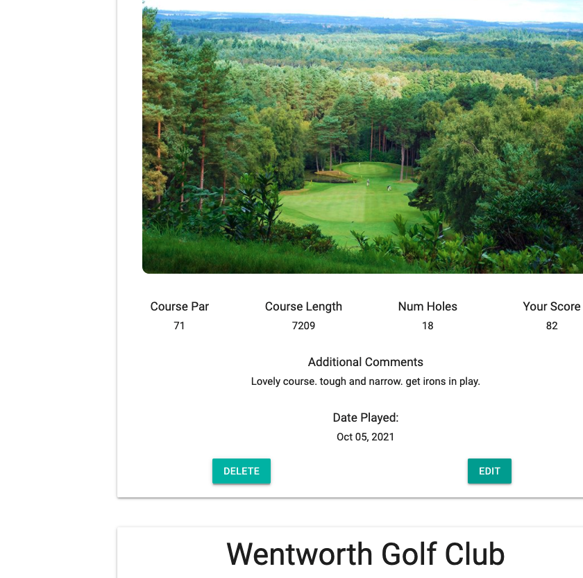

# Dev Tools Testing

I used Dev Tools primarily but also tested across other major browsers, inc Firefox and Safari.

Below is an image of me working thgrough the code in dev tools

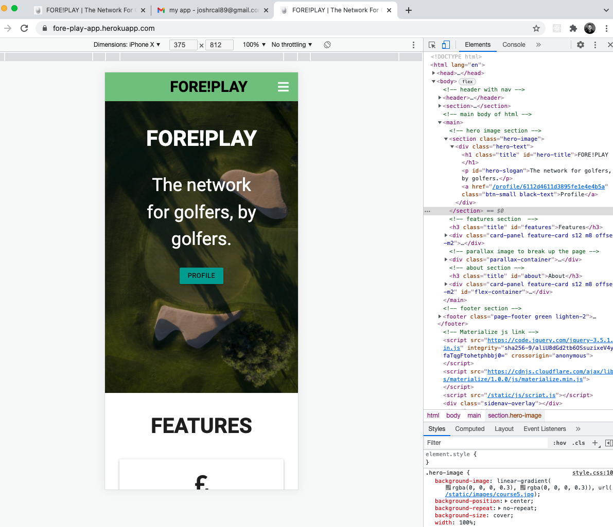

- Lighthouse score

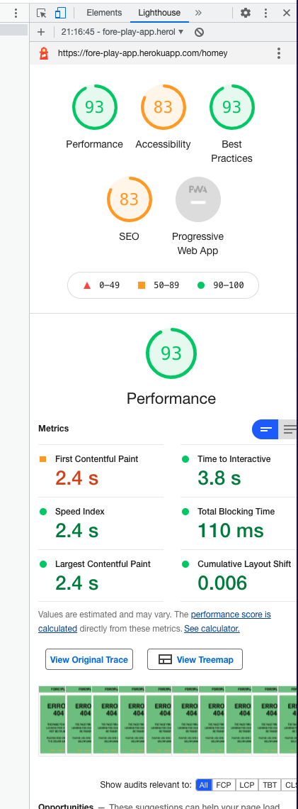

# Validators

No issues found in code validation. A warning stating that between section tags i need h1-h6 tags but these are section tags for the flash messages.

HTML Validation

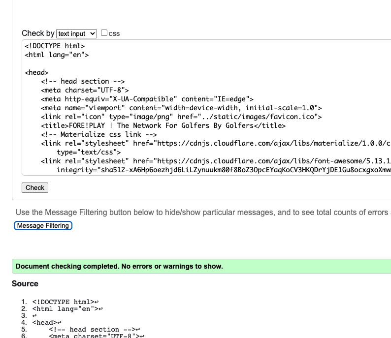

CSS Validation

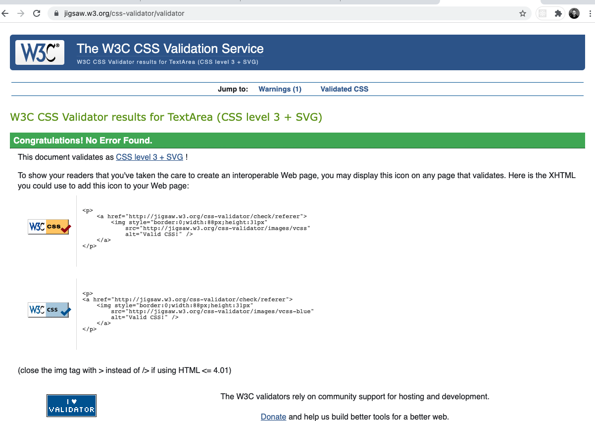
